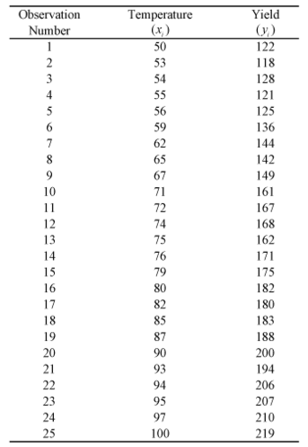
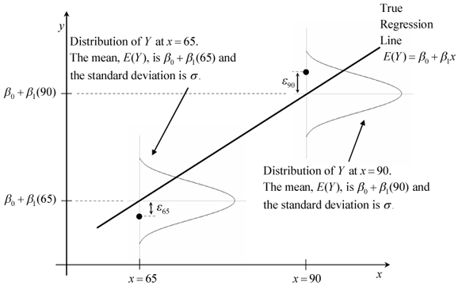
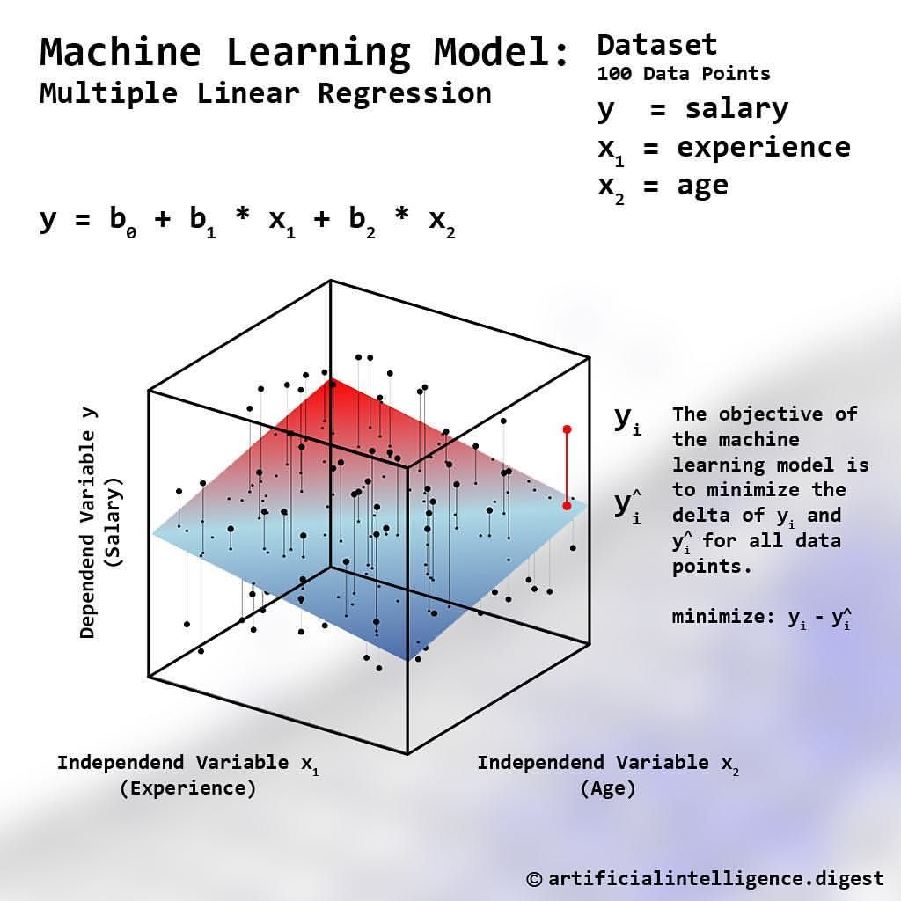

```{r setup, include = FALSE}
library(knitr)
library(rmarkdown)
xaringanExtra::use_panelset()
xaringanExtra::use_clipboard()
# set default options
# opts_chunk$set(dpi = 300)
```

class: title-slide, left, bottom

# `r rmarkdown::metadata$title`
----
## **`r rmarkdown::metadata$subtitle`**
### `r rmarkdown::metadata$author`
### `r rmarkdown::metadata$date`

---

# 목차

.left-column[
]
.right-column[

.pull-left[

.font100[.content-box-green[1 회귀분석]]
  
  - 방법론 소개
  
  - 단순회귀모형
  
  - 실습: 단순회귀모형
  
  - 다중회귀모형
  
  - 실습: 다중회귀모형


      
]

.pull-right[

.font100[.content-box-green[2 ARIMA 모형: 실제 사례 중심]]
 
 - 준비
 
 - 결측치 처리
 
 - 시계열 자료 다루기
 
 - 모형 적합
 
 - 예측
 
]

]

---

class: inverse, middle, center

# 1 회귀분석

---

# 방법론 소개

- 데이터로부터 독립변수(또는 예측변수, $x$)들의 함수를 다음과 같이 추정하여 종속변수(또는 반응변수, $y$)를 예측하는 방법:

\begin{align} 
\hat{y} = f(x_1, x_2, \cdots, x_p). 
\end{align}

- 여기서 $x = (x_1, x_2, \cdots, x_p)^{T}$는 주어지는 값

- $y$는 주어진 $x$에서 측정되는 값으로 벡터로 주어질 수 있음

---

# 단순회귀모형

- 단순선형회귀(simple linear regression)는 예측변수와 종속변수가 모두 1개인 경우에 해당:

\begin{align} 
y = \beta_0 + \beta_1 x + \epsilon, \epsilon \sim N(0, \sigma^2). 
\end{align}

- 오차항 $\epsilon_i \sim i.i.d \ N(0, \sigma^2)$ 에 관한 가정

  - 정규성(Normality)
  
  - 독립성(Independent): ${\rm{Cov}}(\epsilon_{i}, \epsilon_{j}) = 0 (i \neq j)$
  
  - 등분산성(Homoscedasticity): ${\rm{Var}}(\epsilon_{i}) = \sigma^2$

---
# 단순회귀모형

.pull-left[

```{r, echo = FALSE, out.height = 350, out.width = 300, fig.cap = "fig 1. Data"}

```

]

.pull-right[

```{r, echo = FALSE, out.height = 350, out.width = 550, fig.cap = "fig 2. Simple linear regression"}

```

]

\begin{align} 
\hat{y} = \hat{\beta}_0 + \hat{\beta}_1 x 
\end{align}

---

# 실습: 단순회귀모형

## 준비하기

- 패키지 설치

```{r, eval = FALSE}
install.packages("MASS")
install.packages("car")
install.packages("dplyr")
```

- 패키지 로딩

```{r, message = FALSE}
library(MASS)
library(car)
library(dplyr)
```

---

# 실습: 단순회귀모형

## 데이터 소개

.pull-left[
 -   고양이들의 성별, 몸무게(Bwt), 심장몸무게(Hwt)에 관한
    자료 `cats` 이용

```{r, eval = FALSE}
head(cats, 4)
```
```{r, echo = FALSE}
kable(head(cats, 4), format = "html")
```

]

.pull-right[
-   데이터 구조 확인
```{r}
glimpse(cats)
```
]

---

# 실습: 단순회귀모형

## 모형 적합

.scroll-box-20[

- {stats} 패키지의 `lm()`을 이용해 단순회귀모형 적합

```{r}
lm_mod <- lm(Hwt ~ Bwt, data = cats)
summary(lm_mod)
```

]

---

# 실습: 단순회귀모형

## 회귀선 시각화

```{r, warning = FALSE, fig.height=4.5, fig.width=8, fig.retina = 2, fig.align = "center"}
plot(cats$Hwt ~ cats$Bwt, pch = 19, col = "darkgray")
abline(lm_mod, lwd = 2)
```

---

# 실습: 단순회귀모형

## 잔차분석: 등분산성, 정규성

- $y$와 $x$ 간의 relationship에 관한 분석을 목적으로 선형회귀모형을 적합할 때는 잔차분석 필수

```{r, warning = FALSE, fig.height=3.5, fig.width=8, fig.retina = 2, fig.align = "center"}
par(mfrow = c(1, 2))
plot(lm_mod, 1)
plot(lm_mod, 2)
```

---

# 실습: 단순회귀모형

## 잔차분석: 이상점 체크

- 144번 자료에 대한 정보 확인

.pull-left[
```{r}
cats[144, ]
```
]

.pull-right[
```{r}
lm_mod$fitted[144]
lm_mod$residuals[144]
```
]

---

# 실습: 단순회귀모형

## 잔차분석: 독립성 검정

- Durbin-Watson Test를 이용한 잔차의 독립성 검정
  - 더빈-왓슨 테스트 통계량( $d$ )는 $0 < d < 4$ 사이의 값을 가짐
  - $d \rightarrow 2$: 자기상관이 존재하지 않음
  - $d \rightarrow 0$ or $d \rightarrow 4$: 자기상관이 존재함

- {car} 패키지의 `durbinWatsonTest()`를 이용해 잔차에 대해 독립성 검정 수행

```{r}
residuals(lm_mod) |> 
    durbinWatsonTest()
```

---

# 다중회귀모형

- 다중선형회귀(multiple linear regression)는 단순선형회귀의 확장으로 독립변수의 수가 여러개인 경우에 해당:

\begin{align} 
y = \alpha + \beta_{1} x_1 + \beta_2 x_2 + \cdots + \beta_p x_p + \epsilon, \epsilon \sim N(0, \sigma^2) 
\end{align}

- 오차항에 대한 가정은 단순선형회귀의 경우와 같음

---

# 다중회귀모형

```{r, echo = FALSE, out.height = 350, out.width = 500, fig.cap = "fig 3. Multilple linear regression", fig.align='center'}

```

\begin{align} 
\hat{y} = \hat{\beta}_0 + \hat{\beta}_1 x_1 + \hat{\beta}_2 x_2 
\end{align}

---

# 다중회귀모형

\begin{align} 
\boldsymbol{\beta} = (X^TX)^{-1}X^Ty 
\end{align}

- 다중공선성 문제
  - 다중선형회귀에서는 자료의 수( $n$ )가 모수의 수( $p$ )보다 필히 많아야 함( $n \geq p+1$ )
  - $p \geq n$ 인 경우 또는 다중공선성이 심한 경우 $(X^TX)$의 역행렬의 계산이 불가능해 짐 
  - 결과적으로 $\boldsymbol{\beta}$ 추정량의 분산이 매우 커짐
  - 즉, 추정된 회귀계수를 신뢰하기 어려움

- 다중공선성의 징후
  - $X$들 간에 높은 상관계수가 존재할 때
  - 이론적으로 반응변수와 상관이 높을것으로 생각되는 변수임에도 회귀계수가 유의하지 않음
  - 이론적으로 $X$에 따라 반응변수가 증가해야 함에도 회귀계수가 음의 값을 가짐
  - 특정 변수 $X$를 추가하거나 제외하였을 때, 회귀계수의 변화가 크게 일어남

---

# 다중회귀모형

- 다중공선성 문제 해결 방법

  - 상관된 예측변수 제거: 상관성이 높은 변수를 제거해 나가되, $R^2$가 높은 모형 선택
  
      - Variable selection: Forward Selection, Backward elimination, Stepwise selection
      
      - Best subset regression
      
  - 벌점회귀(Penalized regression) 이용
  
      - Lasso regression
      
---

# 실습: 다중회귀모형

## 데이터 소개

 -   미국 50개 주에서 여러 변수값(인구, 수입, 문맹비율, 기대수명, 살인율, 고졸비율, 연평균영하기온일수, 면적)을 측정한 자료
 
 - 이 중 기대수명(`Life exp`)을 반응변수로 다중회귀분석 실시

```{r, eval = FALSE}
head(state.x77, 3)
```
```{r, echo = FALSE}
kable(head(state.x77, 3), format = "html")
```

---

# 실습: 다중회귀모형

## 데이터 소개

.scroll-box-14[

-   데이터 구조 확인
```{r}
glimpse(state.x77)
```

- 데이터프레임으로 변환 후, 변수명 빈칸 제외
```{r}
# install.packages("janitor")
state <- as.data.frame(state.x77) |> 
    janitor::clean_names()
glimpse(state)
```

]

---

# 실습: 다중회귀모형

## 모형 적합

.scroll-box-20[

```{r}
lm_mod2 <- lm(life_exp ~ ., data = state)
summary(lm_mod2)
```

]

---

# 실습: 다중회귀모형

## 다중공선성 검토: 분산팽창요인(VIF, Variance Inflation factor)

\begin{align} 
{\rm{VIF}}_j = \frac{1}{1-R_j^2}
\end{align}

.pull-left[

 - $R_j^2$는 $j$-번째 예측변수( $x_j$ )를 나머지 ( $p-1$ )개의 예측변수로 회귀를 수행하여 구해지는 결정계수

- 10보다 큰 경우 다중공선성을 야기하는 변수로 간주


]

.pull-right[

- {car} 패키지의 `vif()`를 이용해 구할 수 있음
```{r}
vif(lm_mod2)
```

]

---

# 실습: 다중회귀모형

.scroll-output[

- Variable selection: Backward eliination
  
  - `step()` 이용
  
```{r}
lm_mod3 <- step(lm_mod2, direction = "backward", trace = FALSE)
summary(lm_mod3)
```

]

---

# 실습: 다중회귀모형

.scroll-output[

- 신뢰구간 구하기
```{r}
confint(lm_mod3)
```

- 주어진 자료에 대한 예측값 구하기
```{r}
predict(lm_mod3, list(population = 4000, murder = 10.5, hs_grad = 48, frost = 100))
```

]
---
class: inverse, middle, center

# 2 ARIMA 모형: 실제 사례 중심

---

## 준비

.scroll-box-20[

- 패키지 설치
```{r, eval = FALSE}
install.packages("fpp3")
install.packages("readr")
install.packages("showtext")
install.packages("ggplot2")
install.packages("conflicted")
```

- 패키지 불러오기
```{r, message = FALSE}
library(fpp3)
library(readr)
library(showtext)
library(ggplot2)
library(ggh4x)
font_add_google(name = "Nanum Gothic", family = "nanum")
showtext_auto(enable = TRUE)
conflicted::conflict_prefer("select", "dplyr")
ggplot2::theme_set(theme_bw())
```

]


---

## 준비

.scroll-output[

.pull-left[
 - 2010년 1월 - 2021년 9월 월별 익명의 질환 발생 건수에 관한 자료

```{r, message = FALSE}
disease <- read_csv("./data/example.csv")
disease
```
]

.pull-right[

- 8개 그룹에 대해 모델링 필요

```{r}
disease |> 
    select(-Date, -N) |> 
    distinct()
```
  
]

]

---

## 결측치 처리

.scroll-output[

- 결측이 존재하지 않는 데이터이지만 임의로 결측 처리(원자료 값 121)
```{r}
disease2 <- disease |> 
    slice(-2)
disease2
```

]

---

## 시계열 자료 다루기

.scroll-output[

- R에게 우리가 모델링할 시계열이 총 8개임을 알려줘야함

- `as_tsibble()`을 이용할 수 있음

```{r}
disease3 <- disease2 |> 
    mutate(Date = yearmonth(Date)) |> 
    as_tsibble(key = c(Sex, Group), index = Date)
disease3
```

]

---

## 시계열 자료 다루기

.scroll-output[

- `fill_gaps()` 이용 결측치 대치

```{r}
disease4 <- disease3 |> 
    fill_gaps(N = 121L, .full = TRUE)
disease4
```

]


---

## 모형 적합

.scroll-output[

- AICc를 기반으로 최적의 ARIMA 모형 적합

```{r}
mod <- disease4 |> 
    model(arima = ARIMA(N))
mod
```

]

---

## 예측

.scroll-output[

- 향후 15개월 예측 후, 80% 및 95% 신뢰구간 추출

```{r, eval = FALSE}
f <- mod %>% 
    forecast(h = "15 months") %>% 
    hilo(level = c(80, 95)) %>% 
    unpack_hilo(c("80%", "95%"))   # 신뢰구간 값 열로 추출
head(f, 3)
```


```{r, echo = FALSE}
f <- mod %>% 
    forecast(h = "15 months") %>% 
    hilo(level = c(80, 95)) %>% 
    unpack_hilo(c("80%", "95%"))
head(f, 3) |> 
    knitr::kable("html")
```

]

---

## 시각화

- 과거 시점(2010년 1월 - 2021년 9월)의 자료 만들기

```{r}
historic <- bind_rows(
    disease4 %>% 
        mutate(Type = "과거 실제값") %>%
        as_tibble(),
    mod %>% 
        fitted %>%  
        mutate(Type = "모형 적합값") %>% 
        as_tibble %>% 
        rename(N = .fitted) %>% 
        select(Date, Sex, Group, N, Type)
)
```

---

## 시각화

- 미래 시점(2021년 10월 - 2022년 12월)의 자료 만들기

```{r}
fore <- f %>% 
    mutate(Type = "모형 예측값", N = .mean) %>% 
    as_tibble %>% 
    select(Date, Sex, Group, N, Type)
```

---

## 시각화

.scroll-output[

- `{ggplot2}` 이용

```{r, warning = FALSE, fig.height=6, fig.width=12, fig.retina = 2, fig.align = "center", eval = FALSE}
ggplot() +
    geom_line(data = historic,
              aes(x = Date, y = N, col = Type)) + # 과거 실제값, 모형 적합값
    geom_line(data = fore,
              aes(x = Date, y = N, col = Type)) + # 모형 예측값
    geom_ribbon(data = f, # 80% 신뢰구간
                aes(x = Date, ymin = `80%_lower`, ymax = `80%_upper`),
                fill = "skyblue", alpha = 0.25) +
    geom_ribbon(data = f, # 95% 신뢰구간
                aes(x = Date, ymin = `95%_lower`, ymax = `95%_upper`),
                fill = "skyblue", alpha = 0.25/2) +
    scale_color_manual(values = c("tomato", "blue", "paleturquoise3"), name = "") +
    theme(
        text = element_text(family = "nanum", size = 12),
        legend.position = "bottom") +
    labs(x = " ",
         y = "N") +
    facet_nested_wrap(vars(Sex, Group), scales = "free",
                      ncol = 4)
```

]

---

## 시각화

```{r, warning = FALSE, fig.height=7, fig.width=14, fig.retina = 2, fig.align = "center", echo = FALSE}
ggplot() +
    geom_line(data = historic,
              aes(x = Date, y = N, col = Type)) + # 과거 실제값, 모형 적합값
    geom_line(data = fore,
              aes(x = Date, y = N, col = Type)) + # 모형 예측값
    geom_ribbon(data = f, # 80% 신뢰구간
                aes(x = Date, ymin = `80%_lower`, ymax = `80%_upper`),
                fill = "skyblue", alpha = 0.25) +
    geom_ribbon(data = f, # 95% 신뢰구간
                aes(x = Date, ymin = `95%_lower`, ymax = `95%_upper`),
                fill = "skyblue", alpha = 0.25/2) +
    scale_color_manual(values = c("tomato", "blue", "paleturquoise3"), name = "") +
    theme(
        text = element_text(family = "nanum", size = 14),
        legend.position = "bottom") +
    labs(x = " ",
         y = "N") +
    facet_nested_wrap(vars(Sex, Group), scales = "free",
                      ncol = 4)
```
