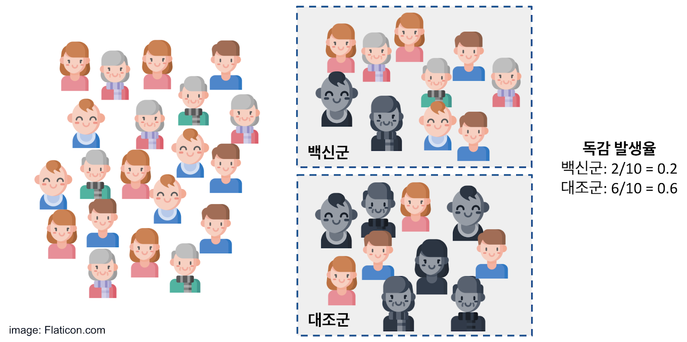
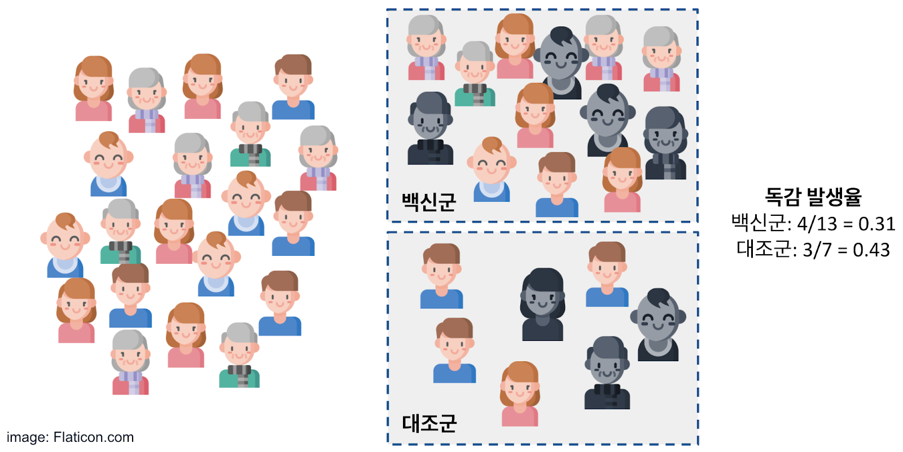
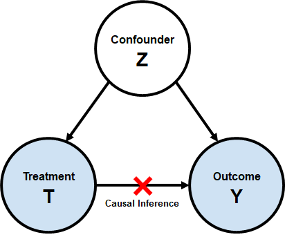
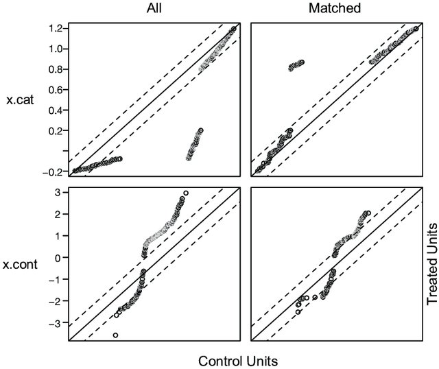
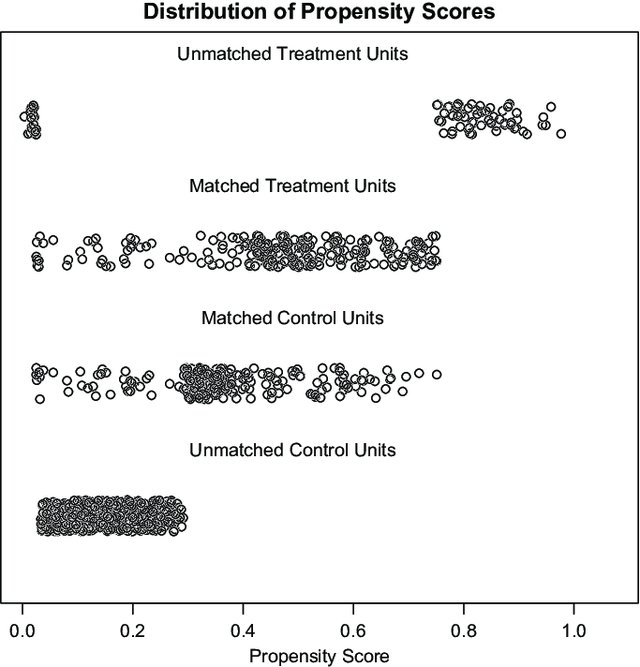
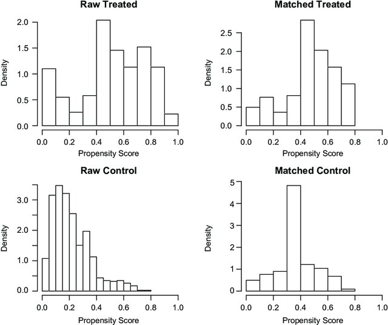
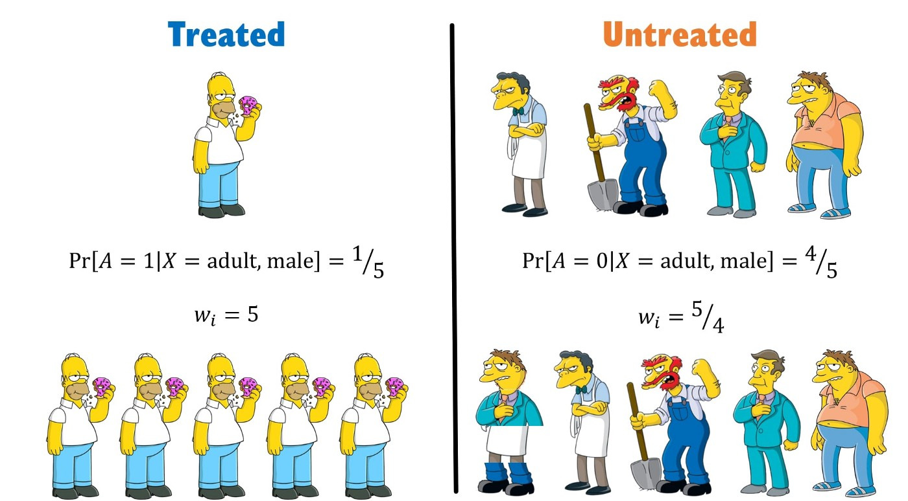

```{r setup, include = FALSE}
library(knitr)
library(rmarkdown)
xaringanExtra::use_panelset()
xaringanExtra::use_clipboard()
# set default options
opts_chunk$set(dpi = 300)
```

class: title-slide, left, bottom

# `r rmarkdown::metadata$title`
----
## **`r rmarkdown::metadata$subtitle`**
### `r rmarkdown::metadata$author`
### `r rmarkdown::metadata$date`

---

# .brand-blue[목차]

.pull-left[
 - .content-box-blue[서론]
 
   - 상관관계와 인과관계
   
   - 인과추론의 조건
   
   - RCT와 RWE
   
   - 혼란변수를 통제하는 방법
   
  
  - .content-box-blue[Propensity score]
  
]

.pull-right[

 - .content-box-blue[PS matching method]
   
   - Nearest neighbor matching
   
   - Optimal matching
    
   - Full matching
 
- .content-box-blue[Balance diagnostics]
 
 
 - .content-box-blue[실습]
 
 - .content-box-blue[Weighting]
 
   - IPTW
 
   - 매칭과 Weighting

]
 
---

class: inverse, middle, center

# 서론

---

## .brand-blue[상관관계와 인과관계]

- 상관(Correlation): 둘 이상의 변인 간의 관련

  - 아이스크림 판매량과 익사 사고 건수 간에는 상관이 존재
  
  - 둘 간의 상관성은 아이스크림 판매량( $x$ )이 익사 사고 건수( $y$ )의 예측에 유용할 순 있음
  
  - 다만, $x$가 $y$의 원인이 된다는 것은 아님
  
  - 그렇다면 이러한 상관이 존재하는 원인은?
  
  - 혼란변수(Confounder)의 존재: 반응변수와 적어도 하나 이상의 예측변수에 영향을 미침

- 인과(Causation): 원인과 결과

  - 비 예보가 있는 경우, 아침에 자건거를 타는 사람들이 줄어듦
  
  - 즉, 강우( $x$, 원인)가 자전거 타는 사람( $y$, 결과)에 영향을 미침
  
  - 인과관계를 결정할 수 있다, 보다 더 나은 모델을 만들 수 있음

---

## .brand-blue[인과추론의 조건]

### .black[1 시간적 우선성]

- 원인이 결과보다 시간상으로 먼저 발생해야 함

### .black[2 공변성(상관관계)]

- 원인이 변화하면 결과도 항상 같이 변화해야 함

### .black[3 통제성]

- 원인과 결과가 제 3의 변수(혼란변수, Confounder)에 영향을 받아서는 안됨

<br>


<center>

<blockquote> .black[_무작위배정을 거치지 않는 관측연구는 "통제성"을 만족시키기 어려움_] </blockquote>

</center>

---

## .brand-blue[RCT와 RWE]

.pull-left[

- RCT 연구

  - 모집단(왼쪽)에서 랜덤으로 각 군에 10명씩 할당
  
  - 일정 연구 기간이 지난 후 독감 발생률 계산

- 목적: 백신과 독감 발생의 관계 확인

- 군간 독감 발생률 차이 = 0.4

]

.pull-right[
```{r RCT, echo = FALSE, out.height = 300, fig.cap = "fig 1. RCT (Linewalk's Blog)"}

```

]

---

## .brand-blue[RCT와 RWE]

.pull-left[

- RWE(Real world evidence): 관찰 데이터를 이용한 후향적 연구

  - 백신 투여 군과 비 투여군을 실험군, 대조군 각 군으로 나눔 
  
  - 각 군에서 독감 발생률 계산

- 군간 독감 발생률 차이 = 0.12

- 선택 편의(selection bias) 발생
  
  - 노령층과 영유아층의 백신 투여율이 높음
  
  - 성별과 나이가 혼란변수가 됨
  
  - 무작위 배정에 의하지 않기 때문에 어떤 현상의 원인 추론이 불가능

]

.pull-right[

```{r RWE, echo = FALSE, out.height = 300, fig.cap = "fig 2. RWE (Linewalk's Blog)"}

```  

]

---

## .brand-blue[혼란변수를 통제하는 방법]

.left-column[

```{r confounder, echo = FALSE, out.height = 200, fig.cap = "fig 3. Confounder (Linewalk's Blog)", fig.align = "center"}

```

]
.right-column[

 - Casual effect 
 
 \begin{align}
  E(Y(1)) - E(Y(0)) = E(Y|T = 1) - E(Y|T=0)
 \end{align}
 
 
 - 관찰연구에서는 혼란변수( $X$ )에 의해 위 등식이 성립하지 않음
 
   - $T=0$일때 $X$의 분포와 $T=1$일때 $X$의 분포가 다르기 때문
 
 - 매칭(Matching)을 통해 해결 가능
 
   - 관찰연구에서 선택편향을 감소시키는 방법론
   
   - How? 실험군과 대조군이 동일한 $X$의 분포를 갖게끔 함으로써
   
  - 그러나, 많은 문제에서 변수를 직접 매칭하는 것은 어려움 (특히 연속형 변수)
  
      - Propensity score로 매칭하는 것으로 충분 (Rosenbaum and Rubin, 1983) 

]

---

class: inverse, middle, center

# Propensity score

---
## .brand.blue[Propensity score]

- 고전적인 매칭 방법이 갖는 단점을 극복하고 선택편향을 최소화하기 위해 사용되는 측도

- 로지스틱 회귀모형을 통해 추정

\begin{align}
\pi = {\rm{Pr}}(Y = 1 | X = x) = \frac{e^{\beta_0 + \beta_1x}}{1 + e^{\beta_0 + \beta_1x}}
\end{align}

- 여기서 $Y$는 처리(treatment), $X$는 혼란변수가 됨

- 각 연구대상의 추정된 $\pi$가 바로 각 연구대상의 propensity score에 해당함

- 즉, propensity score는 연구 대상이 혼란변수에 의해 실험군에 포함될 확률을 의미

- PS(propensity score)가 같은 혹은 유사한 대상끼리 짝을 맞추어 자료 선정

  - .blue[Key idea]: PS의 차이가 작은 대상들끼리 매칭

  - 짝을 이루지 못하면 제외

---

class: inverse, middle, center

# Propensity score matching method

---
## .brand.blue[Nearest neighbor]

.pull-left[
 - 하나의 실험군 대상과 대조군의 모든 대상 간 PS의 차이가 작은 순으로 매칭

- 가장 많이 활용되는 매칭 방법

- Greedy matching 방법론 중 하나에 해당

  - 순간에 최적이라고 생각되는 것을 선택해 나가는 방식
  
  - 실험군 중 어떤 대상부터 매칭을 시작하느냐에 따라 매칭의 지링 달라질 수 있음
]

.pull-right[
 - 주요 옵션

  - 반복 매칭: 대조군의 표본 수가 작은 경우 여러 실험군과 중복하여 매칭되는 대조군 허용
  
  - 정확 매칭: 일부 설명 변수에 대해 정확 매칭을 먼저 시행한 후, 선택된 대상들 사이에서 nearest matching 시행
  
  <!-- 예를 들면 인종과 같이 정확히 매칭해야하는 변수 -->
  
  - 캘리퍼: 추정된 PS의 표준오차의 $k$배 범위에 존재하는 대상만 매칭에 고려
  
  - 대조/실험군 비: 대조군이 실험군에 비해 많은 경우 1:N 매칭을 통해 전체 표본 수를 증가시킬 수 있음
  
]

---
## .brand.blue[Optimal matching]

- 모든 매칭된 짝의 거리가 최소가 되도록 매칭

- Non-greedy matching 방법론 중 하나

- 1:N 매칭 가능

## .brand.blue[Full matching]

- N:N 매칭

- 1:1 매칭은 대조군과 실험군의 PS가 비슷하지 않으면 많은 수의 실험군 자료가 탈락된다는 단점 존재

- 1:N과 N:1 모두 사용하여 매칭 셋을 만듦

<!-- 1:N은 하나의 실험군을 비슷한 성향을 가진 여러개의 대조군과 매칭 -> 대조군 표본이 많은 경우가 -->

- Non-greedy matching 방법론 중 하나

---

class: inverse, middle, center

# Balance diagnostics

---

.pull-left[

## .brand.blue[SMD]

- SMD: Standardized mean difference

- 각 혼란변수에서 두 집단 간 차이가 존재하는가?

\begin{align}
d_{continuous} = \frac{\bar{x}_{trt} - \bar{x}_{con}}{\sqrt{\frac{s^2_{trt} + s^2_{con}}{2}}}
\end{align}
\begin{align}
d_{categorical} = \frac{\hat{p}_{trt} - \hat{p}_{con}}{\sqrt{\frac{s^2_{trt} + s^2_{con}}{2}}}
\end{align}

- 매칭 전과 매칭 후 SMD 비교

- 매칭 후 SMD가 0.1 이하이면 보통 매칭이 잘 이루어졌다고 판단

]

.pull-right[
 
## .brand.blue[QQplot]

- 각 혼란변수별 QQplot을 통해 balance를 체크할 수 있음

- $x$축은 대조군의 혼란변수 분포, $y$ 축은 실험군의 혼란변수 분포가 됨

- 직선에 잘 나열되어 있을수록 매칭이 잘 이루어졌다고 판단

```{r qqplot, echo = FALSE, out.height = 200, fig.cap = "fig 4. QQplot (Zhang, 2017)", fig.align='center'}

```   

]

---

.pull-left[

## .brand.blue[Jitter plot]

- $x$축을 추정된 PS로 하는 그림

- 매칭 과정에서 버려진 샘플들 파악 가능

- 즉, 매칭된 샘플의 대표성을 가늠해볼 수 있음

```{r jitter, echo = FALSE, out.height = 250, fig.cap = "fig 5. Jitter plot (Zhang, 2017)", fig.align = "center"}

```

]

.pull-right[
 
## .brand.blue[Histogram]

- $x$축을 추정된 PS로 하는 그림

- 매칭된 샘플에서의 각 군의 PS 분포가 비슷한지 확인할 수 있음

```{r hist, echo = FALSE, out.height = 350, fig.cap = "fig 6. Histogram (Zhang, 2017)", fig.align = "center"}

```

]

---

class: inverse, middle, center

# 실습

---

## .brand.blue[웹에서 하는 R을 활용한 PSM]

- 🔗[http://web-r.org/lesson](http://web-r.org/lesson)

  - 사전에 🔗[http://web-r.org](http://web-r.org/) 회원가입 필요

  - 3번 항목 propensity score matching 클릭
  
  - 🔗[유튜브 강의](https://www.youtube.com/watch?v=MjzX-DLB0jc&t=4s)

---

class: inverse, middle, center

# Weighting

---

## .brand.blue[IPTW: Inverse Probability of Treatment Weighting]

.pull-left[
- Weighting: 혼란변수의 효과를 통제할 수 있는 또 하나의 방법
  
- IPTW는 추정된 PS의 역수를 가중치로 부여하여 혼란변수의 영향을 최소화함

- 다음의 그림은 IPTW의 아이디어를 가장 간단하고 직관적으로 설명해 줌

  - 각 군에 성인남성이 Unbalanced하게 존재
  
  - 추정된 PS의 역수를 이용해 가중된 샘플을 생성
  
  - 이 가중된 샘플을 Pseudo-population(가상의 모집단)이라하며, 이를 통해 분석을 진행함

]

.pull-right[
```{r IPTW, echo = FALSE, out.height = 500, fig.cap = "fig 7. IPTW (Ehud Karavani)"}

```
]

---

## .brand.blue[매칭과 Weighting]

.pull-left[

### .black[매칭]

- 장점

  - 직관적
  
  - balanced check가 어렵지 않음
  
- 단점

  - 매칭되지 않은 표본은 버리게되어 표본 수가 줄어듦
  
  - 이에따라, 원자료와 Matched sample에서 특성이 크게 달라지면, 원자료의 처리효과와 Matched sample의 처리효과가 달라질 수 있음

]

.pull-right[

### .black[Weighting]

- 장점 

  - 가중치를 줘서 Pseudo-population을 통해 분석을 진행하기 때문에 원 자료를 모두 활용할 수 있음

  - balaced check가 어렵지 않음
  
- 단점

  - PSM 또한 추정된 PS의 정확성에 민감하나, Weighting은 매칭에 비해 PS의 추정의 정확성에 훨씬 민감함
  
  - 따라서, PS 추정의 정확성에 확신이 없으면 선택해서는 안되는 방법

<!-- 그래서, 일반적으로 매칭을 가장 첫 번째로 고려할 수 있고 그 다음으로 고려하는 것이 매칭 -->

]

---

## .brand.blue[책 추천]

- 🔗[R 기반 성향점수분석](http://www.kyobobook.co.kr/product/detailViewKor.laf?mallGb=KOR&ejkGb=KOR&barcode=9788955662450)

- 🔗[통계적 인과 추론(개정판)](https://www.kyowoo.co.kr/02_sub/view.php?p_idx=1640&cate=0014_0019_)

---

class: inverse

# Thanks!

.pull-right[.pull-down[

<a href="mailto:favorite@kakao.com">
.white[`r icons::fontawesome("paper-plane")` favorite@kakao.com]
</a>

<a href="https://github.com/be-favorite">
.white[`r icons::fontawesome("github")` @be-favorite]
</a>

<a href="https://twitter.com/TaemoBang">
.white[`r icons::fontawesome("twitter")` @TaemoBang]
</a>

<a href="https://github.com/be-favorite/Presentation_archive">
.white[`r icons::fontawesome("link")` Presentation archive]
</a>

<br><br><br>

]]
